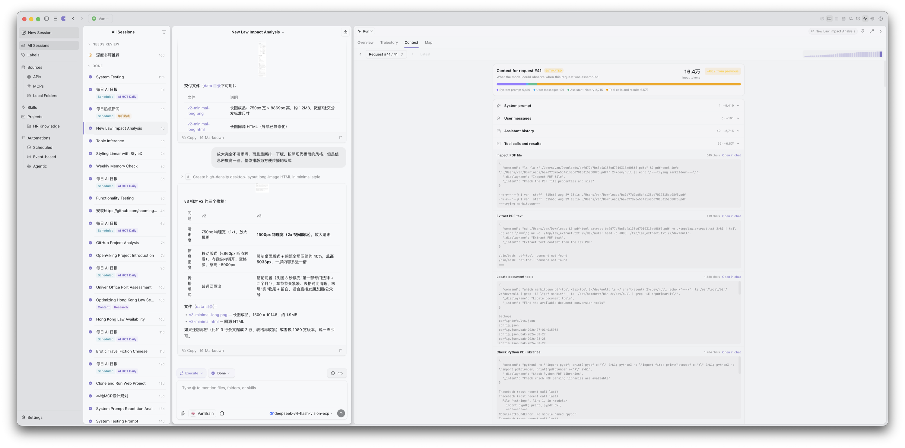
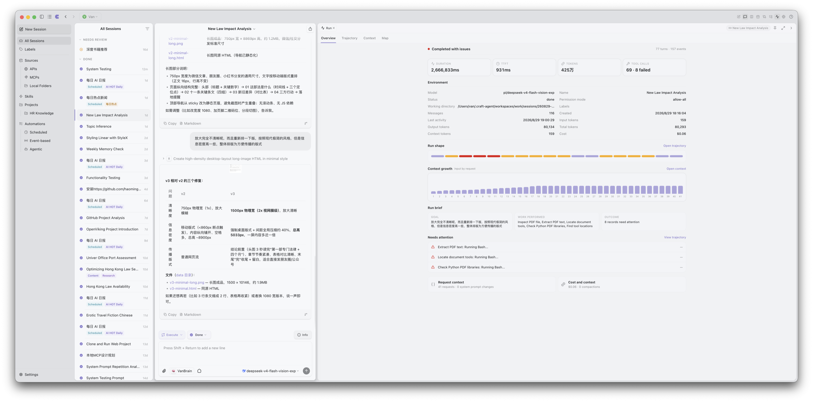
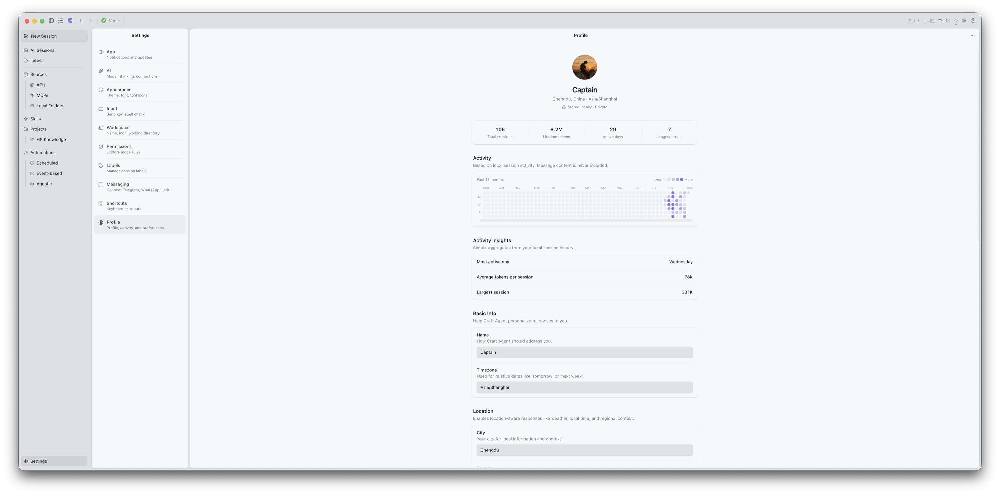
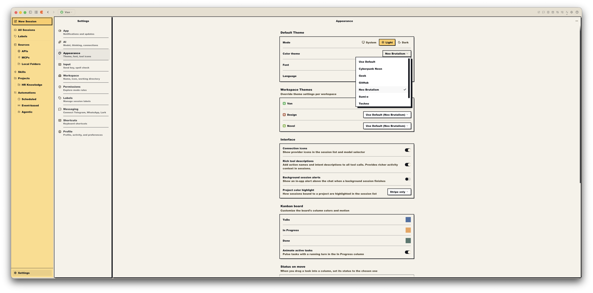

<div align="center">

# Craft Agents (RE)

### A local-first agent workspace with durable execution and inspectable runs.

Run capable AI agents across your files, tools, services, and documents — with a desktop workspace that makes every important action reviewable.

[](apps/electron/resources/release-notes/0.12.1.md)
[](docs/pi-kernel.md)
[](https://bun.sh/)
[](LICENSE)
[](README.zh-CN.md)

</div>



Craft Agents (RE) is an open-source desktop and server workspace for serious agent work. It combines persistent sessions, a multi-panel workbench, connected tools, automation, file artifacts, and a single Pi-powered agent runtime.

The defining difference is trust: a run is not just a stream of prose. Craft records execution boundaries, tool outcomes, context growth, token usage, cost, and recovery state so you can understand what happened and decide what should happen next.

## Work that stays inspectable

Agent work should not disappear behind a spinner. The Run workspace gives each session four complementary views:

- **Overview** summarizes duration, time to first token, tokens, cost, tool outcomes, context growth, and items that need attention.
- **Trajectory** reconstructs turns, model responses, tool calls, failures, compaction, and timing as an inspectable execution ledger.
- **Context** shows how each model request was assembled, including prompt, conversation, and tool-result contributions.
- **Map** reveals related sessions and branches without losing their execution history.

Underneath the UI, a workspace-local SQLite/WAL runtime records model and tool effects across explicit T1/T2 boundaries. Ambiguous effects are parked as unknown instead of being silently replayed or presented as completed.



## A workspace, not a chat window

The desktop app is organized around durable work rather than disposable conversations.

| Capability | What it gives you |
| --- | --- |
| **Persistent multi-session workspace** | Sessions, projects, labels, statuses, calendar, board, and background work remain available across restarts. |
| **Content Workbench** | Open chat, review, files, previews, artifacts, context, Run views, and browser surfaces side by side. |
| **Sources and skills** | Connect MCP servers, REST APIs, local folders, and reusable `SKILL.md` instructions without hard-coding services into the agent. |
| **Permissions and recovery** | Explore, Ask to Edit, and Auto modes combine with durable execution evidence and explicit recovery decisions. |
| **Automations and messaging** | Schedule work, react to events, and reach agents through supported messaging gateways. |
| **Headless and CLI operation** | Keep long-running sessions on a remote server while using the desktop app, Web UI, or `craft-cli` as clients. |

## Files become reviewable artifacts

Craft treats generated and modified files as deliverables with a lifecycle, not opaque attachments. Artifact revisions carry validation results and provenance, can be previewed safely when supported, and remain pending until you accept or discard them.

The shared format registry covers text and source files, Markdown, structured data, images, PDF, Office and OpenDocument formats, media, archives, and unknown binaries. Existing document tools continue to do the actual editing and conversion, while Artifact provides one consistent review boundary.

Native image generation follows the same path: one tool call produces a validated image Artifact with provider, model, connection, prompt, parameters, and revision metadata attached.

## Personal by design

Profile and appearance are local product surfaces, not account requirements. The profile summarizes local activity without including message content and keeps user-authored preferences separate from observed usage. The semantic theme engine controls color, surfaces, depth, borders, typography, icon weight, and density, with app-level defaults and per-workspace overrides.

<table>
  <tr>
    <td width="50%"></td>
    <td width="50%"></td>
  </tr>
  <tr>
    <td><strong>Local profile</strong><br />Private activity summaries, identity, location-aware preferences, and explicit personalization.</td>
    <td><strong>Semantic themes</strong><br />User-owned visual systems that can change far more than an accent color.</td>
  </tr>
</table>

## One runtime, many providers

Every provider uses the same Pi agent backend, event contract, tool registry, permissions, and session lifecycle. The Pi runtime runs in an isolated subprocess so provider or agent failures do not become a second desktop execution path.

```text
Electron Desktop  ·  Web UI  ·  craft-cli
                    │
          server-core / Runtime Host
      sessions · permissions · sources · artifacts
                    │
            JSONL subprocess boundary
                    │
          Pi SDK · provider APIs · tools
```

The connection layer supports major hosted providers, OAuth-backed products, cloud platforms, and OpenAI-/Anthropic-compatible custom endpoints. Models and thinking levels are resolved from provider capabilities instead of a fork-specific second backend.

### Current foundation

| Layer | Baseline |
| --- | --- |
| Agent kernel | Pi SDK `0.84.4` |
| Desktop | Electron `43.1`, React `19.2` |
| Runtime and tooling | Bun `1.4.0`, TypeScript `7`, Vite `8.1` |
| Integrations | MCP SDK `1.29+`, native REST/local/browser tools |
| Storage | Local session data plus workspace-local SQLite/WAL durable runtime |

## Quick start

### Requirements

- [Bun 1.4](https://bun.sh/) or the compatible version pinned by `package.json`
- Credentials for at least one supported model provider
- macOS, Windows, or Linux

```bash
git clone https://github.com/VanDING/craft-agents-rebuild.git
cd craft-agents-rebuild
bun install
bun run electron:start
```

On first launch, add an AI connection, create a workspace, and optionally connect sources or local folders. Use **Shift+Tab** in a session to cycle through Explore, Ask to Edit, and Auto permission modes.

### Headless server and CLI

```bash
CRAFT_SERVER_TOKEN=$(openssl rand -hex 32) bun run server:start
bun run apps/cli/src/index.ts run "Summarize this repository"
```

See the [CLI reference](docs/cli.md) for remote connections, TLS, scripting, and validation.

## Development

```bash
bun run electron:dev       # Desktop development with renderer HMR
bun run typecheck:all      # Type-check every workspace package
bun run validate:dev       # Type checks plus focused runtime/document tests
bun run validate:ci        # CI validation plus i18n parity and coverage
```

Start with the [documentation index](docs/README.md), [contribution guide](CONTRIBUTING.md), and [Pi kernel maintenance baseline](docs/pi-kernel.md).

## Built on Craft, with gratitude

Craft Agents (RE) is an independent fork of [`craft-ai-agents/craft-agents-oss`](https://github.com/craft-ai-agents/craft-agents-oss), originally created by the [Craft](https://www.craft.do/) team and its contributors. Their open-source work made this project possible, and we are deeply grateful for that foundation.

This fork keeps the original attribution while pursuing its own runtime, auditability, workspace, Artifact, Profile, and theme direction. It is not endorsed by or affiliated with Craft Docs Limited. See [NOTICE](NOTICE) and [TRADEMARK.md](TRADEMARK.md) for attribution and naming details.

## License

Licensed under [Apache License 2.0](LICENSE).
