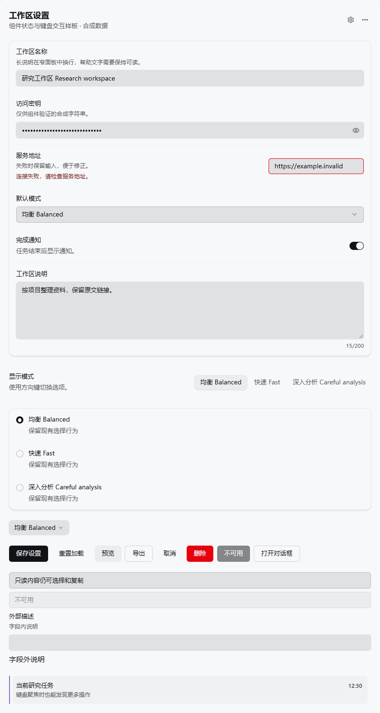
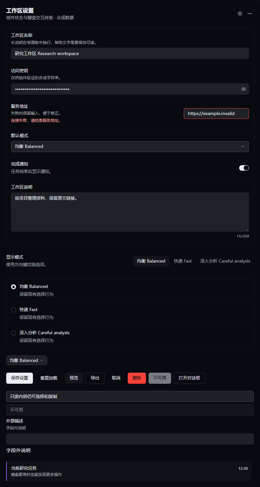
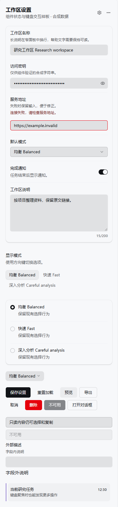
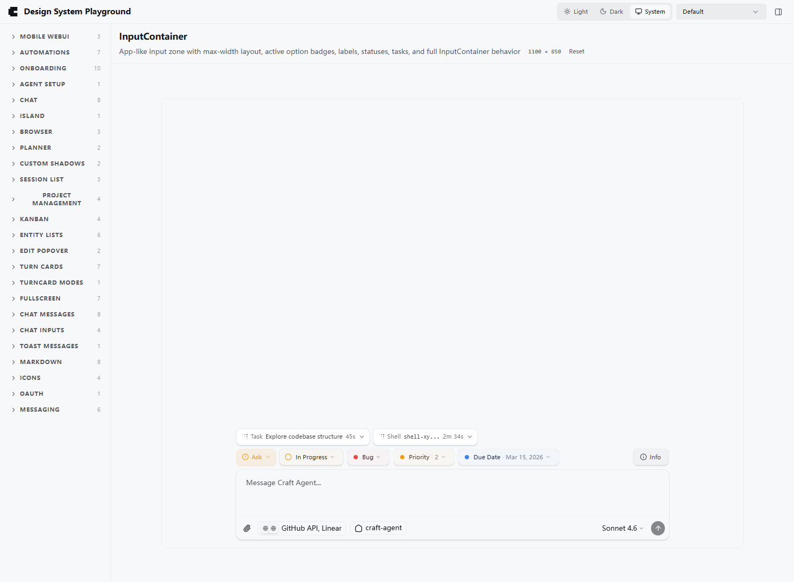
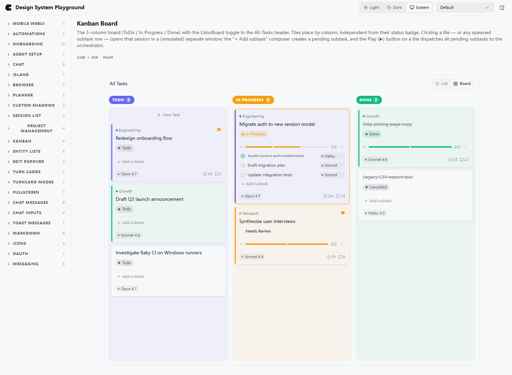

# UI 组件体系完善：实施与验收记录

日期：2026-09-09。对应 [设计方案](ui-design-system-refinement-plan-2026-09-09.md)。

## 1. 交付结论

已按 M0–M5 推进代码实施：借鉴 HeroUI 的状态、组合与可访问性原则，完善现有 Radix/shadcn 和共享 UI。没有引入 HeroUI、React Aria 或其他新依赖，没有更改主题 JSON 协议。

M0–M4 的公共组件与页面接入已落地；M5 已完成当前环境可执行的跨端构建、浏览器交互、主题、窄屏与性能检查。**原生 Electron 窗口验收未通过环境启动阶段，不能宣称全部平台已验收。** 真实操作系统 IME、移动设备与已安装客户端仍需环境可用时复验。

## 2. 基线与范围

- 基线提交：9865a077bc8cb26d3854d25c2455a3767512eeae；Windows，Bun 1.4.2，Node 24.15.0，Edge 152.0.4191.66。
- 使用真实生产组件和合成资料，不使用用户账户、凭据或真实会话；Playwright 使用独立浏览器存储。
- 基线生产构建、修改后生产构建使用同一个 Electron Vite 配置；构建与原始日志保存在本机忽略目录 `.cache/ui-refinement/`。
- 基线确认：服务地址字段未暴露 `aria-invalid`；密码显隐、焦点、列表菜单和窄屏布局有可改善之处。基线设置截图保存在本目录 assets 中。
- 保留既有中性主按钮、看板状态色、即时菜单、Dialog 动效时长、Map 视口和 Run 主题桥接。没有重构状态存储、路由或列表算法。

## 3. M0–M5 落地表

| 阶段 | 本轮结果 | 验证 |
| --- | --- | --- |
| M0 基线 | 生产资源快照、已有设置截图、真实控件样例 | 同环境、同配置对比；基线提交明确 |
| M1 基础 | 共享 controls.css；按钮 loading；图标按钮焦点/圆角；Input、Textarea、Field ID/说明/错误关联 | 错误和描述关联、调用方描述合并、加载禁用和宽度稳定、密码键盘操作 |
| M2 交互 | 设置字段族、Select、可搜索菜单、Radio 方向键、Switch、Dialog/Popover、主题化 Tooltip/Toast | 嵌套浮层 Escape、焦点恢复、搜索空态和方向键、reduced motion |
| M3 工作台 | EntityRow 菜单移到主按钮外、键盘显现；Header、Tabs、Composer、Badge | 无嵌套按钮、行菜单键盘操作、输入区焦点、合成 IME、防重复提交 |
| M4 页面接入 | 工作台标签、看板按钮、任务列表、浏览器控件直接接入；其余消费者通过共享控件继承 | 10 个代表样例渲染无页面异常；见下表 |
| M5 验收 | 三端生产构建、四套类型检查、浅深/自定义主题、窄屏、触摸模拟、产物和流式复测 | 浏览器验收通过；原生窗口与真机项保留限制 |

## 4. 页面覆盖与有意保留

| 页面/场景 | 接入方式与覆盖 | 保留或限制 |
| --- | --- | --- |
| 设置、连接 | SettingsInput/Secret/Select/Textarea/MenuSelect/Radio/Toggle、Field 共用角色；外观页为分段组提供名称 | 连接请求逻辑和凭据存储保持原有行为；Telegram 样例是仓库现有 rework draft，并非真实账户连接 |
| 会话列表 | EntityRow 共用焦点、标题/说明、兄弟菜单按钮；100/1000 合成行 | 不引入每行观察器、订阅、测量或虚拟化改造 |
| 聊天输入 | FreeFormInput 焦点表面、原生动作焦点；InputContainer 实际样例 | 保留输入、附件、发送与流式业务；IME 只做合成组合事件检查 |
| Run/活动 | Tabs、菜单、Tooltip、共享文字语义传导；嵌套运行卡片及流式样例 | 保留四种视图的专业布局、Map 视口及主题桥接；未完整执行真实会话四视图端到端流程 |
| 项目、看板、规划 | WorkItemListView、KanbanColumn、TaskTile 直接接入焦点；看板与 Planner 样例 | 保留状态色和列布局；未改拖拽数据流 |
| Automation | 列表的 EntityRow、按钮与浮层继承统一规则；列表样例渲染检查 | 不改变调度或触发逻辑 |
| 文件、Artifact、浏览器 | BrowserControls 直接接入；文档/代码预览与公共浮层继承；预览样例检查 | 不改变编辑器、文档渲染器和原生浏览器生命周期 |
| Onboarding | 复用按钮、输入与共享状态样式；Wizard 首屏样例检查 | 未使用真实认证完成整条引导 |
| WebUI、viewer | 原有 CSS 导入链引入同一个 controls.css | 不增加重复 reset，不把 Electron 组件反向引入共享包 |

## 5. 交互与视觉结果

- 31 项真实组件浏览器断言通过：字段语义、密码显隐、Header 焦点、单选导航、loading、嵌套 Select/Dialog、菜单空态、行操作与焦点恢复等。
- 默认浅/深主题截图已检查；使用真实 `themeToCSS` 在浏览器中生成 flat / glass / raised / neon、compact / cozy、小/大圆角，不写入用户主题目录。
- 420px、390px 控件面板无横向溢出；窄屏输入行左对齐并铺满可用宽度。额外验证根字号 20px（默认 16px 的 125%）。这不是完整系统缩放验收。
- 触摸模拟下图标按钮最小 CSS 尺寸 44×44，密码显隐可通过 tap 使用；测试载体为桌面浏览器中的窄组件面板，不等于真实移动 WebUI 真机验收。
- 输入区合成 composition + Enter 不提交组合中的中文文本；焦点表面为 2px outline。真实系统输入法未验证。
- 新增样式不引入装饰性 JS 循环；spinner 仅在 loading 时挂载，reduced motion 下停止旋转。

默认主题按计算样式转换为 sRGB、叠加背景后计算；未使用抗锯齿截图像素：

| 文字 | 浅色对比度 | 深色对比度 |
| --- | ---: | ---: |
| 字段标签 | 17.50:1 | 17.07:1 |
| 字段说明 | 6.79:1 | 8.51:1 |
| 字段错误 | 9.91:1 | 10.15:1 |
| 输入正文 | 14.18:1 | 13.85:1 |

上述只覆盖所测默认字段文字，不代表全产品 WCAG 认证，也不保证任意用户自定义配色。placeholder、所有页面文字和真实移动缩放组合尚未逐项验收。

## 6. 性能与产物

### 6.1 主入口资源

口径：`index.html` 直接引用的 JS/CSS 与 modulepreload 合计，gzip 为 Node zlib 默认压缩。包含公共 CSS，不包括延迟加载的全部业务路由；这是可复现的入口资源预算，不等于所有首屏网络请求的完整采集。

| 资源 | 基线原始字节 | 修改后原始字节 | 基线 gzip | 修改后 gzip |
| --- | ---: | ---: | ---: | ---: |
| JS | 9187170 | 9194945 | 2617810 | 2620597 |
| CSS | 312043 | 314183 | 50202 | 50972 |

JS gzip 增加 2787 字节，CSS gzip 增加 770 字节。来源为字段/键盘语义、控件状态与共享样式；没有新增包依赖。

### 6.2 实际交互与流式样例

使用相同生产 InputContainer 的模型菜单，预热一次后各测五次。pointerdown 后观察菜单出现，再记录下一 animation frame；它是可见帧代理值，不是精确像素呈现延迟：

- 基线：中位数 94.1 ms，范围 50.5–137.7 ms。
- 修改后：中位数 102.4 ms，范围 39.1–110.7 ms。

两组范围高度重叠，不能从五次样本推断提速，也没有足够证据认定可复现回退。自动化点击往返耗时另存 JSON，没有混作菜单自身耗时。

同一现有 StreamingSimulationTurnCard，normal 配置、相同合成文本、每 tick 2 字符、基础间隔 10ms（标点停顿 150ms），两份生产产物均回放到完整末句：

- 基线：399 个采样帧，1 个超过 50ms 的主线程任务；中位数 16.7 ms，范围 14.7–199.8 ms。
- 修改后：422 个采样帧，1 个超过 50ms 的主线程任务；中位数 16.7 ms，范围 16.2–99.7 ms。

帧间隔排除首帧与初始化时刻之间的差值；原始数组完整保存在 JSON。

这些是本机单次回放，不是生产负载统计或 React commit benchmark。100/1000 项 EntityRow 使用新增合成夹具，完成滚动并记录帧间隔；由于基线没有同一夹具，**不报告列表前后提速比例**。

## 7. 检查结果与限制

| 检查 | 结果 |
| --- | --- |
| Electron / WebUI / viewer 生产构建 | 通过；保留已有体积提示与部分 browser externalization 警告 |
| Electron / WebUI / viewer / packages/ui 类型检查 | 通过 |
| 共享菜单与主题聚焦测试 | 19 pass，0 fail |
| 真实控件浏览器检查 | 31 项通过 |
| 主题、窄屏、125% 字号、列表检查 | 通过 |
| i18n 排序 | 通过 |
| 本轮 3 个新文案键 | 七种语言齐全 |
| 仓库完整 i18n parity | 未通过：de/es/hu/ja/pl 均缺 sidebar.profile.setup/view；已用 HEAD 逐一确认是基线问题，本轮未扩展修改这两条历史文案 |
| 原生 Electron | 未完成：44.2.0 隔离隐藏窗口加载失败，GPU 子进程退出 -1073741515（0xC0000135），软件渲染重试仍失败；不能据此证明原生标题栏、拖拽、窗口缩放正常 |
| 真实移动设备/其他 OS/系统 IME | 未验证 |

未启动完整测试套件；按仓库约定只运行受影响组件的必要检查。构建/样例中的外部模块警告与原生环境失败不隐藏，也不通过修改产品安全配置绕过。

## 8. 可复跑检查

从仓库根目录启动开发样例：

```powershell
bun run vite --config apps/electron/vite.config.ts --host 127.0.0.1 --port 5189 --strictPort
# 另一个终端
node scripts/test-ui-controls-browser.mjs
node scripts/test-ui-controls-layout.mjs
bun test ./packages/ui/src/components/ui/__tests__/styled-dropdown.test.ts ./packages/shared/src/config/__tests__/theme.test.ts
```

真实脚本使用独立浏览器存储，Windows 默认 Edge，其他平台使用已安装的 Playwright Chromium。layout 脚本需要开发服务器以导入真实 themeToCSS；100/1000 是合成数量。

截图与全部采样：[verification.json](assets/ui-refinement-2026-09-09/verification.json)。原生失败日志及产物在本机 `.cache/ui-refinement/`。未提交、未推送、未打包替换已安装客户端。

## 9. 代表截图

### 默认浅色



### 默认深色



### 390px 面板



### 主工作台输入区



### 看板


